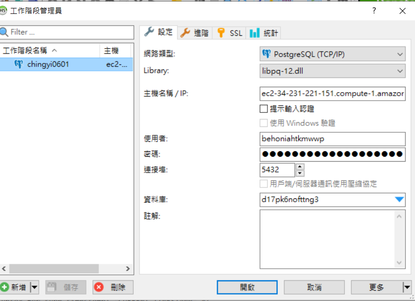
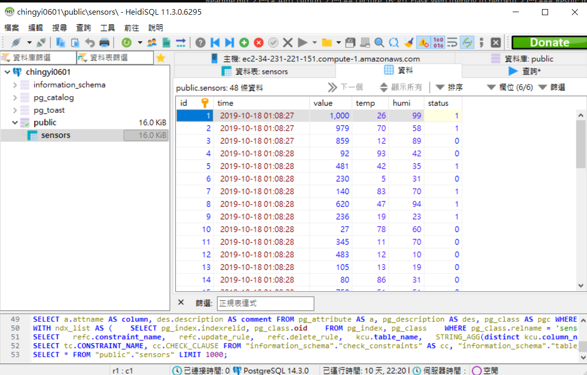
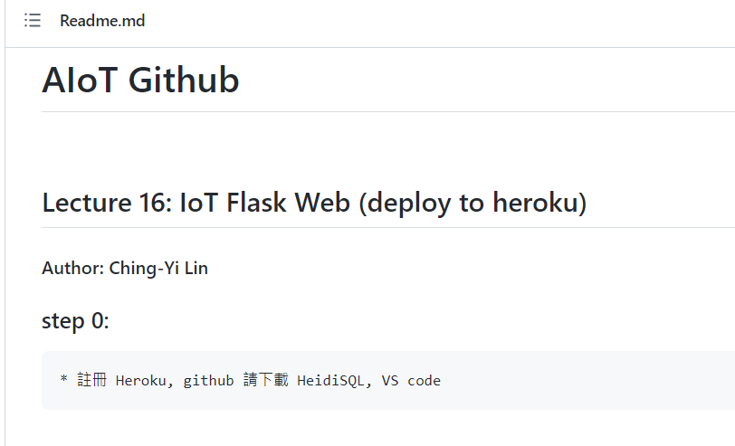

# AIoT Github
<br>

## Lecture 16: IoT Flask Web (deploy to heroku)
#### Author: Ching-Yi Lin 

### step 0:
    * 註冊 Heroku, github 請下載 HeidiSQL, VS code

### step 1 : Clone this github
* git clone https://github.com/huanchen1107/aiot0530-start-no-token 到 local\aiot0531 folder
    * 把local的 \aiot0531\.git 殺掉 (產生自己的git管理員) 方便建立新的git repository 
    * 推送至github 建立新的 aiot0531
    https://github.com/takingnot/aiot0531

### step 2 : install some package


```python
pip install gunicorn  Flask==2.0.1 Jinja2==3.0.1 psycopg2 sklearn pandas numpy
```

### step 3: add an heroku postgredb

* register heroku account
* go to dashboard
* new an app
* go to resource and add-on an Heroku postgredb

### step 4: login to heroku pstgredb using HeidiSQL


```sql
myserver ="<fill-in-Heroku-Postgredb-DB-sever>"
myuser="<fill-in-Heroku-Postgredb-DB-user>"
mypassword="<fill-in-Heroku-Postgredb-DB-pwd>"
mydb="<fill-in-Heroku-Postgredb-DB-db>"

```
### step 5: import postgredb (in db/postgre.db)



### step 6: setting db in app.py


```sql
myserver ="<fill-in-Heroku-Postgredb-DB-sever>"
myuser="<fill-in-Heroku-Postgredb-DB-user>"
mypassword="<fill-in-Heroku-Postgredb-DB-pwd>"
mydb="<fill-in-Heroku-Postgredb-DB-db>"

```
### step 7: testing locally by running python app.py
### Result: (remote random sensor points)

### Result: (remote after AI  prediction)


### step 8: deploy to github (new public github repositoy 不然看不到)

delete .git and git remote add origin master github.com/xxxxx


### step 9: Heroku deploy from github

### step 10: Complete

Sample link 1:
https://awinlab-aiot.herokuapp.com/

Sample link 2: 
https://chingyi0601.herokuapp.com/

### Result: (remote random sensor points)

### Result: (remote after AI  prediction)


